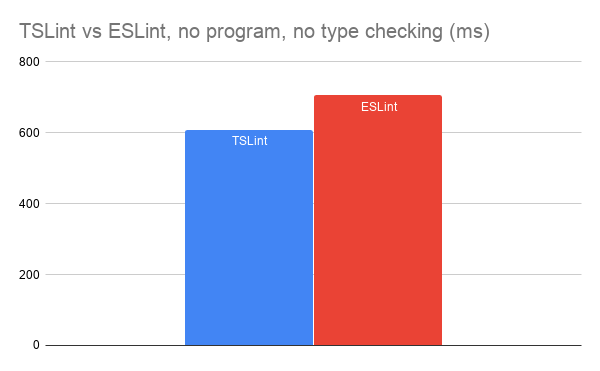
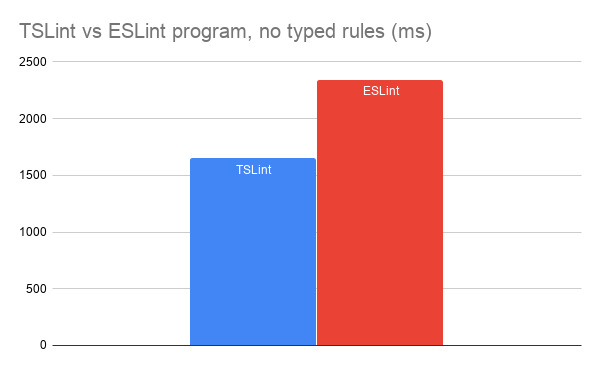
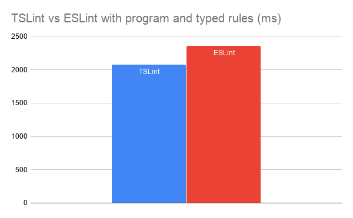

# ESLint vs TSLint

Performance comparison of TSLint & ESLint. There are the results from 3 tests:

1. Linting of individual files without type checking and without `ts.Program` creation.
2. Linting of the entire program, without typed rules.
3. Linting of the entire program with a single typed rule.

For each experiment, linting is run 10 times. The charts present the average linting duration.

## No type checking, no program



**ESLint**

```
time find -f src/ | grep '\.ts$' | xargs ./node_modules/.bin/eslint
```

**TSLint**

```
time find -f src/ | grep '\.ts$' | xargs ./node_modules/.bin/eslint
```

## TypeScript program, no typed rules



**ESLint**

```
time ./node_modules/.bin/eslint --ext ts src
```

**TSLint**

```
time node_modules/.bin/tslint -p tsconfig.json
```

## TypeScript program, typed rule



**ESLint**

```
time ./node_modules/.bin/eslint --ext ts src
```

**TSLint**

```
time node_modules/.bin/tslint -p tsconfig.json
```

## License

MIT
